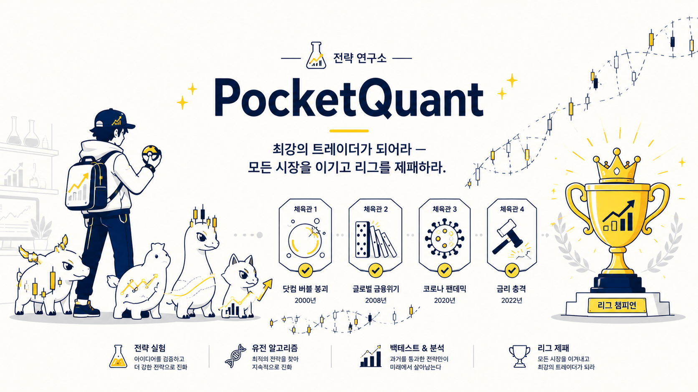

# 🎮 PocketQuant

> **Gotta Money 'Em All**

포켓몬 리그 우승엔 강한 포켓몬 하나만으로는 부족하다.
타입 상성, 역할 분담, 밸런스를 고려해 **최적의 파티**를 구성해야 한다.

투자도 마찬가지다.

PocketQuant는 **포켓몬 파티 구성을 포트폴리오 최적화 문제로 재해석**하여,
유전 알고리즘(GA, 나아가 Optuna NSGA-III)으로 **최적의 전략 조합을 탐색하는 실험 프로젝트**다.

<p align="center">
  
</p>

> *비공식 팬메이드 학습 프로젝트입니다. 닌텐도 · 게임프리크 · The Pokémon Company와 무관하며 비상업적입니다.*

> 📈 **실데이터(yfinance) 백테스트 기반입니다.** 각 전략을 실제 시장 국면 6개(닷컴·금융위기·회복장·코로나·상승장·횡보장)의
> **QQQ(나스닥100)** 가격으로 백테스트해 **HP/ATK/DEF/SKILL 4스탯**을 뽑습니다. (투자 자문 아님 — 학습용)

---

## 🧩 컨셉

| 게임 용어 | 실제 의미 |
|-----------|-----------|
| 포켓퀀트 1마리 | 시그널 1개 |
| 트레이더 / 전략 | 시그널을 운용하는 모델 |
| 파티 | 포트폴리오 |
| 체육관 (6개) | 시장 국면 (regime) |
| 체육관 도전 | 백테스트 |
| 스탯 (HP/ATK/DEF/SKILL) | 성과 지표 (현금비중/CAGR/Calmar/샤프) |
| **라이벌 '성실이'** | **DCA 봇** — 매일 같은 금액을 묵묵히 사 모으는 녀석 (수수료도 0원) |
| 돼지저금통 | '전부 현금' 기준선 — 돈을 넣기만 하고 시장에 안 들어감 (최적화의 숙적, 봉인 3회) |
| 어플삭제맨 | B&H(항상 풀매수) 기준선 — 사자마자 어플을 지운 존버의 화신. 돼지저금통과 함께 시험에 출전한다 |
| 저축왕 | 은행 기준선 — 연 3%(CMA/자유적금) 무위험 복리. 낙폭 0이라 방어 스탯 만점 착시가 있어 순위표엔 미참가, 표시 전용 |
| 리그 본선 | 워크 포워드 (처음 보는 미래 데이터로 출전) |
| 배틀 프론티어 | 합성 데이터 스트레스 테스트 (예정) |
| 사천왕 | post-COVID hold-out — **봉인됨, 최후의 1회만 도전 가능** |
| 아카데미 (팔데아) | cGAN 합성 시장 생성기 — 다른 지수 = 다른 지방, 유학 검증 (예정) |
| 교배 · 진화 | 유전 알고리즘 (GA → NSGA-III) |

---

## 🎯 이 프로젝트가 풀고 싶은 문제

최강의 포켓퀀트는 존재할 수 있다.
하지만 **모든 체육관을 이기는 포켓퀀트는 존재하지 않는다.**

투자 전략도 마찬가지다.

PocketQuant는 **"가장 강한 전략"** 이 아니라,
**"다양한 시장 국면에서 살아남는 전략 집합"** 을 찾기 위해 만들어졌다.

그리고 이 게임의 진짜 최종 보스는 시장이 아니라 **라이벌 '성실이'(DCA 봇)** 다 —
매일 정해진 금액을 수수료 0원으로 묵묵히 사 모으는 녀석을 이기지 못하는 전략은,
아무리 화려해도 데려갈 이유가 없다.

> 이 문제의식이 단일목적 GA를 넘어 **다목적 최적화(NSGA-III)** 로 향하는 이유다.
> (자세한 정식화는 **[OPTIMIZATION.md](OPTIMIZATION.md)** 참고.)

---

## 🧬 스타팅 6마리 (시그널) — 3타입 × 2마리

전략은 아래 유전자를 조합해 만들어집니다. 각 유전자는 **실제 지표 로직**으로,
가격을 받아 그날의 포지션(0~1, 1=풀매수·0=현금) 또는 **기권**을 만듭니다.

| 타입 | 유전자 | 로직 (포지션) |
|------|--------|------|
| 💧 위험회피 | `DD`  | 드로다운 스탑 — 고점 대비 −10% 넘게 빠지면 현금화 |
| 💧 위험회피 | `VOL` | 실현변동성 레짐 — 평온=탑승 / 중간=반반 / 격동=현금 |
| 🔥 추세순응 | `MA`  | 가격 > 200일 이평이면 탑승 |
| 🔥 추세순응 | `MOM` | 모멘텀 — 최근 ~3개월 수익률이 양수면 탑승 |
| 🌿 역발상 | `REV_RSI` | **이벤트형** — RSI(14) < 30 과매도 투매면 매수 의견, 평소엔 기권 |
| 🌿 역발상 | `REV_BB`  | **이벤트형** — 볼린저 하단밴드 아래 과대 낙폭이면 매수 의견, 평소엔 기권 |

**전략 포지션 = 그날 의견 낸 유전자들의 평균 (기권 제외).** 이벤트형(REV)은 평소
벤치에 앉아 있다가 투매가 터진 날만 출전합니다 — "의견 없음"이 "현금 가라"로
집계되던 함정(잉어킹 강제 출전 문제)을 막는 규칙. 전원 기권한 날은 현금(0)입니다.

> 🧪 구 `RSI`(과열 회피)·`BB`(상단 회피)는 실측 결과 평균 포지션 0.84/0.97 =
> 사실상 죽은 시그널이라 2026-06-10 재배치에서 도감 제외.

예시 이름: `MA-VOL킹`, `VOL-REV_RSI-REV_BB몬`, `DD-MA-MOM몬`, `타이탄 드래곤`

---

## 💱 매매 방식 (어떻게 사고파나)

신호가 뜨면 "전부 사고/판다"가 아니라, **매일 "주식을 몇 % 들고 있을지(비중)"** 를 정해 거기에 맞춥니다.

- 각 유전자가 매일 비중을 뱉습니다: `1.0`=풀매수 · `0.0`=전부 현금 · `0.5`=반반 · 기권=의견 없음
- 전략 비중 = 그날 **의견 낸** 유전자들의 비중 **평균** (기권은 제외, 전원 기권이면 현금)
- 매일 그 비중으로 **리밸런싱** (비중이 그대로면 보유, 바뀌면 그만큼만 사고팜)
- 사고판 금액에는 **수수료 0.1%** (토스증권 미국주식 기준)를 차감

```
그날 수익 = (어제 비중) × (오늘 QQQ 등락)
```

예) 어제 50% 들고 있었는데 오늘 QQQ +2% → 내 자산 +1%. 현금 부분은 이자 0%.
신호는 종가로 확인하고 **다음 날** 반영합니다 (미래를 미리 안 보게 하루 lag = 룩어헤드 방지).

> ⚠️ **단순화된 시뮬레이션**입니다 — 수수료 0.1%는 반영하지만 세금·슬리피지·환율은 0,
> 매일 정확히 비중 조정, 소수점 주식 가능, 현금 이자 0% 가정. "어느 전략이 어느 시대에
> 강한가"를 비교하는 연구 도구이지 실거래 권유가 아닙니다.

---

## 🏟️ 체육관 6개 (시장 국면) — 배지 6개를 모아라

각 체육관은 **실제 역사적 기간**이며, 그 기간의 **QQQ** 가격으로 백테스트합니다
(훈련 자산 = 실투자 자산. `difficulty`/`volatility`는 연출용 메타데이터 — 실제 난이도는 가격이 직접 만듭니다).

| 체육관 | 관장 | 기간 | 성격 |
|--------|------|------|------|
| 🕸️ 2000-02 닷컴 붕괴 | **버블** (고스트) — "꿈은 공짜였지. 꿈값은 아니었고." | 2000-03 ~ 2002-12 | 갈아내리는 긴 하락(-83%), 가짜 반등 연타 → 역발상엔 칼날 잡기 지옥 |
| 💀 2008 금융위기 | **리먼** (강철/어둠) — "버틴다고? 시스템이 무너지는데?" | 2008-01 ~ 2009-06 | 연쇄 청산 대폭락(-49%) → 방어형 천국, 공격형 지옥 |
| 🌅 2009-10 회복장 | **불사조** (불꽃/비행) — "겁쟁이는 내 등에 못 탄다." | 2009-03 ~ 2010-12 | 바닥에서 수직 상승(+101%) → 겁먹고 내리면 반등을 통째로 놓침 |
| 🦠 2020 코로나 급락 | **브이** (전기) — "눈 깜빡이면 끝나 있어." | 2020-02 ~ 2020-06 | 한 달 -29% 후 즉시 풀반등 → 손절한 자가 최대 피해자 |
| 🔥 2017 불타입 상승장 | **황소** (불꽃) — "지루하지? 그게 내 필살기야." | 2017-01 ~ 2017-12 | 출렁임 없는 우상향(+33%) → 방어 비용을 회비처럼 징수 |
| 🌫️ 2015-16 횡보장 | **미로** (에스퍼) — "방향? 그런 건 처음부터 없었어." | 2015-01 ~ 2016-12 | 헛신호 연타로 추세형을 수수료로 말려 죽임 — 현 챔피언도 최약 과목 |

> 🗺️ 관장 상세 카드(주특기/공략법)는 도감에서: `config.json`을 `"mode": "dex"`로 → `python main.py`

> 💡 하락 3 / 회복·상승·횡보 3으로 일부러 균형을 맞췄다 (회복장은 "시험지가 하락
> 편향"이라는 지적으로 2026-06-11 추가 — 트레이더의 철학: **나스닥 장기 우상향 베팅,
> "살을 내줘도 뼈를 취한다"**). 한 전략이 여섯 국면을 다 잘하긴 어렵다 — 이 충돌이
> 스탯에 그대로 찍히고, 다목적 최적화가 필요한 이유가 된다.
>
> 🔒 **post-COVID(2020-07~)는 사천왕이다.** 훈련 체육관으로 쓰는 것 금지.
> NSGA-III가 끝나고 최종 합격 판정 때 딱 한 번 도전한다.

---

## ⚔️ 전투 로직 (백테스트 → 스탯)

```
1) 유전자들이 만든 일별 포지션(0~1)을 하루 lag 적용해 시장 수익에 곱함 (룩어헤드 방지)
   + 포지션 변화량 × 0.1%를 거래비용으로 차감
2) 체육관 기간만 잘라 자산곡선에서 CAGR / 최대낙폭(MDD) / 샤프 / 평균현금을 측정
3) 0~100 스탯으로 정규화:
     ❤️ HP    = 평균 현금 비중           (위기 버틸 체력 — 표시 전용, 적합도 제외)
     ⚔️ ATK   = CAGR                      (0%→0, +25%→100)
     🛡️ DEF   = Calmar = CAGR/|내MDD|     (-1→0, 3→100 · 낙폭 한 단위당 수익)
     ✨ SKILL = 샤프비율                  (-1→0, 3→100)
```

**적합도(0~100) = 체육관별 점수의 [평균 70% + 최약 30%]** — 리그 규정상,
평균만 좋고 한 체육관에서 처참한 트레이더는 챔피언이 될 수 없다.
등급: `S`(≥90) `A`(≥70) `B`(≥50) `C`(≥30) `D`(그 외). 종족치 `BST = 4스탯 합` (표시용).

### 🧟 돼지저금통 봉인의 역사 — "아무것도 안 하기"는 세 번 부활했다

최적화기는 목적함수의 빈틈을 반드시 찾아낸다. '전부 현금'(돼지저금통)이 1등을 먹으려던 경로 3개를 전부 실측으로 잡아 봉인했다:

| # | 부활 경로 | 봉인 |
|---|----------|------|
| 1 | HP(현금)를 적합도에 포함 → 돼지저금통 69점 1위 | HP 가중치 0 + DEF=Calmar 재설계 |
| 2 | 최약 체육관 가중 50% → 돼지저금통는 "최약 과목이 없어서" 30위까지 부상 | min 가중 30% (게이트 지키는 실측 최대치) |
| 3 | DCA 대비 점수를 평균으로 결합 → 하락장에서 돼지저금통가 라이벌을 이김 | 평균 결합 금지, NSGA-III에서 벡터 그대로 |

> 감시 장치: `python tests/test_baselines.py` — 돼지저금통가 하위 25% 밖으로 기어나오면 FAIL.

---

## 🤖 라이벌: 성실이 (DCA 봇)

라이벌 성실이는 화려한 기술이 없다. **매 거래일 같은 금액으로 QQQ를 사 모을 뿐이다.**
그런데 무섭다:

- **수수료 0원** (토스증권 '주식 자동 모으기' 기준 — 전략의 타이밍 매매는 0.1% 과금. 비대칭이 현실이다)
- 감정 없음, 뇌절 없음, 자동
- 급락장에선 싸게 모아서 단순보유를 이기기도 한다 (코로나 체육관: DCA +15.7% vs 단순보유 +13.5%)

`battle.fight_dca()`가 성실이를 소환하고, `score_vs_dca`로 라이벌전 점수를 매긴다:

```
score_vs_dca = 0.4×(수익 차이) + 0.4×(낙폭 개선) + 0.2×(샤프 차이)    # 양수 = 라이벌보다 강함
```

실측: **여섯 체육관 전부에서 성실이를 이기는 조합은 0개.** 위기 체육관을 이기면
상승장에서 보험료를 낸다 — 이 트레이드오프의 지도(Pareto front)를 그리는 게 NSGA-III의 일이다.

---

## 🚀 실행

> ⚠️ 반드시 **프로젝트 루트**에서 실행하세요. 한글 깨지면 (Windows): `$env:PYTHONIOENCODING="utf-8"`
> 의존성: `pip install -r requirements.txt` (+ NSGA-III용 `optuna`). 첫 실행만 QQQ 데이터를 받아 `data_cache/`에 캐시 → 이후 오프라인 동작.

실행 옵션은 전부 **config.json**으로 관리합니다 (CLI 플래그 없음 — 값 바꾸고 `python main.py`):

```jsonc
{
    "mode": "single",     // single(단판) | evolve(진화 GA) | dex(도감)
    "genes": null,        // [단판] 유전자 개수 (null = 랜덤)
    "pop": 20,            // [진화] 개체군 크기
    "generations": 10,    // [진화] 세대 수
    "seed": null,         // 랜덤 시드 (숫자 넣으면 재현 가능)
    "md": null,           // Markdown 리포트: null=안 씀, ""=기본 경로, "경로"=지정
    "capital": null,      // 실전 시뮬 시작 자본(원). 예) 10000000
    "oak": false          // true면 리포트 끝에 오박사(로컬 LLM) 브리핑 — LM Studio 필요
}
```

#### 출력 예시 (시드 42, 2026-06-11 기준)

```
=== PocketQuant 진화 백테스트 ===
개체군 20마리 · 진화 10세대

1. 데이터 로딩: QQQ 실데이터 6개 국면

[ 1세대] 최고 적합도  40.3점  최강 전략: REV_BB
[10세대] 최고 적합도  42.6점  최강 전략: VOL+REV_RSI+REV_BB

=== 최종 챔피언 ===
유전자: VOL, REV_RSI, REV_BB
최종 적합도: 42.6점 / 100 (평균 70% + 최약 30%)
최약 체육관: 2008 금융위기 체육관 (13.1점)
```

> 📌 **현 챔피언 `VOL+REV_RSI+REV_BB` (42.6점)** — 위험회피(VOL) 1마리가 상시
> 출전하고, 역발상 2마리(REV_RSI/REV_BB)가 투매일에만 난입하는 파티. 전 조합(63개)
> 전수조사 1위와 일치하고, 시드를 바꿔도(42/7) 같은 답으로 수렴하며, 체육관 구성을
> 바꿔도(5개→6개) 1위를 지켰다 = 시험지에 과적합된 게 아니라 조합 자체가 단단하다.
> 라이벌전은 6전 4승 2패 (닷컴 +58, 상승장 +27, 코로나 +15, 회복장 +4 / 금융위기 -3, 횡보 -9).
> 그리고 '항상 풀매수'가 전체 4위(37.9점)다 — **우상향 자산에서 "그냥 들고 있기"는
> 진짜 강적이고, 그걸 적합도로 이기는 조합은 단 3개뿐이다.**

---

## 🏆 리그 시스템 (검증 프로토콜)

체육관 점수는 인샘플(이미 본 시험지)이다. 진짜 실력은 리그에서 가린다.

> 🪙 단, 관문은 사형장이 아니다 — **"상폐가 아니면 뒤진 게 아니다"** (트레이더 슬로건).
> 못 통과한 트레이더는 죽는 게 아니라 **벤치**로 간다: 명단은 DB에 보존되고,
> 시장에 있는 한 복리는 일하고 있으며, 다음 리그/관문에서 재도전한다.
> 관문이 정하는 건 "누가 죽었나"가 아니라 **"누구에게 사천왕 도전권을 주나"** 뿐이다.

| 단계 | 무엇 | 상태 |
|------|------|------|
| 🏟️ 체육관 (훈련) | QQQ 실데이터 6국면 백테스트 | ✅ 운영 중 |
| 🎫 리그 본선 (워크 포워드) | 과거 4년으로 1등 선발 → **처음 보는 다음 1년**에 출전, 1999~현재 반복 | ✅ PASS — QQQ 23폴드: MDD **-22.9% vs 단순보유 -53.4%**, 샤프 0.81 vs 0.76 |
| 🗼 배틀 프론티어 (평행세계) | 진짜 수익률을 한 달 블록으로 재배열한 "있을 법했지만 없었던 역사"에서 운빨 검사 | ✅ 챔피언 통과 — 200세계 승률 69%·방어 98% |
| 👑 사천왕 (hold-out) | post-COVID(2020-07~) — **봉인. 최후의 1회만.** 결과 보고 목적함수를 고치면 반칙 | 🔒 봉인 중 |

심판 도구 (포켓퀀트센터 정기검진):

- `python tests/test_baselines.py` — 🧟 돼지저금통 감시 (퇴화 게이트)
- `python tests/check_signals.py` — 🩺 시그널 노출/발동률/상관 진단
- `python tests/check_dca.py` — 🤖 라이벌전 전적 계측
- `python tests/walk_forward.py` — 🎫 리그 본선 (파라미터로 자산/훈련길이/비용 민감도 실험)
- `python tests/test_engine_regression.py` — 🔬 골든 넘버 16개 (엔진 계산이 바뀌면 즉시 적발)
- `python tests/test_no_lookahead.py` — 🕵️ 컨닝 검사 (미래를 잘라도 과거 포지션 불변)

---

## 👥 연구소 식구들

<p align="center">
  
  
</p>

- **오박사 (Dr. Oh)** — 주식 시장 쌉고인물. 닷컴·리먼·브이를 전부 계좌로 맞아보고
  살아남아, 지금은 한강 둔치에서 소주 한잔 까며 후배 성적표를 봐준다.
  `config.json`에 `"oak": true`면 리포트 끝에 등장 (로컬 LLM · 해설 전용, 판정 안 함).
  계좌가 개박살난 날엔 이렇게 말해준다: *"오늘 한강물 수온이 낮단다. 힘내렴."*
- **No.001 무슈 (Monsieur)** — 견습 퀀트 포켓퀀트이자 **연구소 마스코트
  (연구소장의 실제 반려견)**. 작은 노트북을 항상 품고 다니며 레거시 코드
  적응력이 특성. 진화 라인: 무슈 → 무슈 프로 → 박사 무슈.

---

## 📖 용어 도감 (퀀트 용어 → 포켓퀀트 번역)

| 퀀트 용어 | 포켓퀀트 번역 | 뜻 |
|---|---|---|
| 룩어헤드 (lookahead) | **컨닝** | 내일 상대 기술을 미리 보고 오늘 기술을 고르는 것. 백테스트 사기의 왕. 심판 `test_no_lookahead`가 "미래를 잘라도 과거 포지션 불변"으로 적발 |
| 데이터 누수 (leakage) | **시험지 유출** | 훈련에 쓴 문제가 시험지에 섞이는 것. 컨닝의 사촌 — 그래서 시험지(검증 연도)를 훈련 체육관과 겹치지 않게 자른다 |
| 과적합 (overfitting) | **체육관 암기** | 기출문제 답을 외워서 리그에선 만점, 처음 보는 시험에선 백지. 실측: v1 리그 인샘플↔OOS 상관 **-0.21** = 암기범 31명 전원 적발 |
| 인샘플 / OOS | **기출 점수 / 실전 점수** | 이미 본 시험지 성적 vs 처음 보는 시험지 성적. 기출 점수는 자랑이 아니다 |
| hold-out | **봉인된 최종 시험지** | 사천왕. 끝까지 안 보고 아껴두는 시험 — 자꾸 보면서 고치면 그것도 기출이 된다 (1회용, 2026-06-11 개봉됨) |
| 워크 포워드 | **컨닝 불가 모의고사** | 과거로만 팀을 짜서 다음 1년에 출전, 매년 반복. "고르는 과정 자체"가 실전에서 통하는지를 잰다 |
| 부트스트랩 | **평행세계 생성** | 진짜 역사를 한 달 블록으로 잘라 다른 순서로 재생 — 같은 재료, 다른 운. 배틀 프론티어의 동력원 |
| MDD (최대낙폭) | **최대 데미지** | 고점에서 최대 몇 % 까였나. HP바가 제일 깊게 패인 순간 |
| 샤프 비율 | **컨트롤 점수** | 출렁임(멀미) 대비 수익. 같은 돈을 벌어도 덜 어지럽게 번 트레이더가 고수 |
| 턴오버 | **PP 소모** | 매매 횟수. 기술을 쓸 때마다 수수료 PP가 닳는다 — PP 무한인 건 성실이(자동 모으기 0원)뿐 |
| 보험료 | **회비** | 위기 때 보상받으려고 평시에 꼬박꼬박 내는 비용. 관장 황소가 징수 담당 |
| 퇴화 (degeneration) | **돼지저금통 현상** | 옵티마이저가 목적함수의 빈틈을 찾아 "아무것도 안 하기"로 수렴하는 것. 지금까지 3회 봉인 |
| Pareto front | **비길 수 없는 자들의 명단** | 서로 우열을 가릴 수 없는 트레이더 집합 — 누구는 방어가, 누구는 회복이 강해서 한 줄로 못 세움 |
| 워밍업 | **준비운동** | 지표(200일 이평 등)를 데우는 선행 구간. 성적 계산엔 안 들어감 |

---

## 📁 구조

3층 구조: **main(입력) → service(흐름) → backend(계산)**

```
pocket_quant/
├─ main.py                 # config.json 읽어 service 호출 (CLI 플래그 없음)
├─ config.json             # 실행 옵션
├─ OPTIMIZATION.md         # 최적화 정식화 + NSGA-III 설계서
├─ app/
│  ├─ service.py           # 실행 흐름 조립 (단판/진화/도감 + 시드 + 출력)
│  └─ backend/
│     ├─ core/             #   models.py — dataclass + 적합도(평균70+최약30)/등급
│     ├─ market/           #   data.py(가격+캐시) · gym.py(QQQ 체육관 6종)
│     ├─ genes/            #   signals.py(유전자→포지션/기권, 결합 규칙) · dex.py(도감)
│     └─ engine/           #   battle.py(백테스트→스탯, DCA 라이벌, score_vs_dca) · strategy.py · evolve.py(GA)
├─ tests/                  # 심판 도구 6종 (위 표 참고)
└─ worklog/                # 실험실 노트 (로컬 전용)
```

---

## 🔮 로드맵

- ✅ **v0.2 단일목적 GA** — 개체군·선택·교배·돌연변이·세대
- ✅ **v0.3 실데이터 + 스탯블록** — yfinance 백테스트, 생존판정 → 4스탯
- ✅ **v0.3.1~2 적합도 퇴화 수정 + 거래비용** — 돼지저금통 1차 봉인, 수수료 0.1%
- ✅ **v0.4 스타팅 6마리 재배치** — 3타입×2마리, 기권(NaN) 결합, config.json, 백엔드 재구성
- ✅ **v0.4.1 worst-case 적합도** — 평균 70% + 최약 30% (50/50은 돼지저금통 부활로 기각 — 실측)
- ✅ **v0.5 QQQ 통일 + 회복장 체육관 + DCA 라이벌 + 심판 2종** — 훈련 자산=실투자 자산, 6체육관, score_vs_dca, 골든 넘버/컨닝 검사
- ✅ **NSGA-III (Optuna) + 챔피언로드 완주** — v1 리그(13차원)는 관문①에서 체육관 암기(과적합) 적발로 전멸, v2(가중치 전용)는 정직(상관 +0.93)하지만 천장 = 현 챔피언. 사천왕(hold-out) 개봉: **벽** (단 6년 누적은 성실이 전 지표 우위 — 방어 오버레이 가치 입증). 설계: [OPTIMIZATION.md](OPTIMIZATION.md)
- 🥚 **에그랩 (다음 알파)** — 지수 조합으로 새 포켓퀀트 부화: VIX·금리·QQQ/SPY비율 등 **새 정보를 보는 시그널**로 천장 자체를 올린다. 부화 절차·알 후보: [egglab/README.md](egglab/README.md)
- ⏭️ **웜스타트 시드 제너레이터** — 리그를 랜덤 신인만으로 시작하지 않고, 검증된 유망주(현 챔피언·전수조사 상위·이전 리그 라벨 트레이더)를 `study.enqueue_trial`로 선출전 → 수렴 가속 + 이전 스터디 자산 재활용 (v2 리그에서 실증: 연속 탐색이 동일가중점을 정확히 못 찍음)
- ✅ **배틀 프론티어** — 블록 부트스트랩 평행세계 운빨 검사 (챔피언 통과 69%/98%, bear 스페셜리스트 #1918 발굴)
- 🏫 **아카데미 (팔데아 지방 개척)** — **나스닥 데이터로 cGAN을 학습시켜 "다른 지방"의 시장을 합성**하는 생성기. 부트스트랩(기존 역사 재배열)을 넘어, 국면 라벨을 조건(condition)으로 나스닥의 통계적 질감을 가진 **새로운 가격 경로**를 생성 → 새 지방의 체육관을 개설해 트레이더를 유학 보낸다. 본 적 없는 지방에서도 통하는 트레이더 = 진짜 robust.
  **학습 데이터 = 리그가 이미 만들어 둔 것**: ① 체육관 = 국면 라벨이 붙은 나스닥 구간들(cGAN의 조건-샘플 쌍 그 자체) ② 리그 DB(`optuna_pocketquant.db`) = 트레이더 5000명의 국면별 전적 기록. (학습 재료도 hold-out 봉인 규칙 적용 — 2020-07 이후 데이터로는 학습하지 않는다)
- ✅ **사천왕전** — 2026-06-11 개봉(1회용 소진). 판정: 벽. 이후 최종 판정은 미래 데이터로만
- ✅ **오박사(LLM)** — LM Studio 로컬 모델(gemma)이 성적표를 읽고 성과 귀인 해설. `config.json`에 `"oak": true` (해설 전용 — 판정 안 함)
- 🗂️ **전략 도감 DB** → 🧭 **시장 판독기** (regime detector, 70% robust + 30% tilt 오버레이 — Defensive 틸트 1호 후보 #1918 대기 중)

---

## ⚠️ Disclaimer

PocketQuant는 **학습 및 연구 목적**으로 제작된 비공식 팬메이드 프로젝트입니다.
실제 과거 시세(yfinance)로 백테스트하지만, **투자 자문·금융 상품 추천·미래 수익 보장과는 무관**하며 어떤 투자 판단의 근거로도 쓰여선 안 됩니다.

"포켓몬", "Pokémon" 및 관련 명칭/이미지에 대한 모든 권리는 닌텐도 · 게임프리크 · The Pokémon Company에 있습니다.
본 프로젝트는 이들과 **무관한 비상업적 팬 작업물**이며, 영리 목적으로 사용되지 않습니다.

---

## 📜 라이선스

장난감 프로젝트입니다. 자유롭게 사용하세요. 🎈
